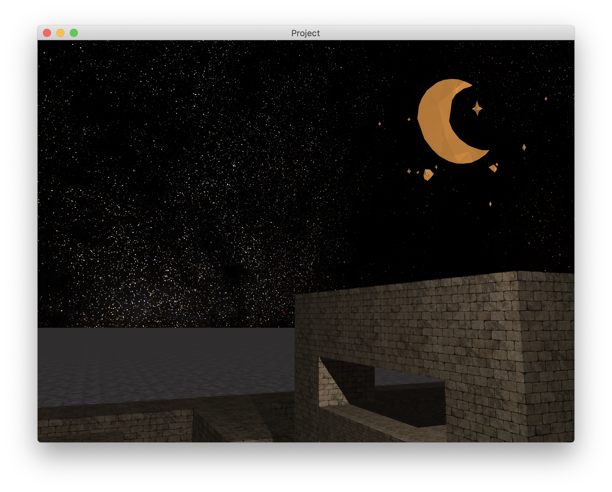

# CGCourse

This is the final project for CGCourse 2019 in ZJU


## Dependencies:

- glfw
- glad 
- glew
- stb_image
- assimp
- cmake

## Build:

```
mkdir build
cmake ../.
make
```

### TODO:

* 增加阴影检测
* 增加CG
* 增加截图功能
* 增加碰撞检测
* 实现nurbs曲面
